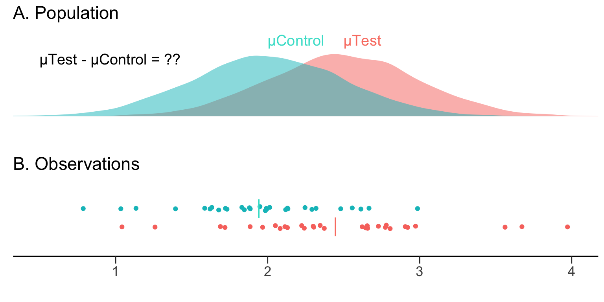

```{r setup, include=FALSE}
knitr::opts_chunk$set(echo = TRUE)
```


<a href="https://github.com/nshahpazov/rpubs/blob/main/r-statistics-notes.Rmd" rel="repo" style="width: 50px; height: 50px; position: absolute; top: 60px; right: 10px"></a>

## Точкови оценки
Ако имаме наблюдения $x_1, ..., x_n$ над случайна величина $X \sim \mathcal{N}(\mu, \sigma^2)$, 
то можем да мислим на всяко наблюдение $x_i$ като на наблюдение от случайна
величина $X_i$ разпределена като $X$ и $X_i$ са независими. Тоест, имаме
независими и еднакво разпределени (н.е.р.) случайни величини 
$X_1, ..., X_n \overset{distr}{\sim} X \sim \mathcal{N}(\mu, \sigma^2)$, като сме получили 
по едно наблюдение от всяка. Векторът $(X_1,...,X_n)$ наричаме **случайна извадка**.

Тогава $\bar{x} := \frac{1}{n}\sum_{i=1}^n{x_i}$ е наблюдение от
случайната величина $\bar{X} := \frac{1}{n}\sum_{i=1}^n{X_i} \sim \mathcal{N}(\mu, \frac{\sigma^2}{n})$,
понеже 
$$
E[\bar{X}] = E[\frac{1}{n}\sum_{i=1}^n{X_i}]=\frac{1}{n}\sum_{i=1}^n{E[X_i]}=\frac{1}{n}n\mu = \mu\\
Var[\bar{X}]=Var[\frac{1}{n}\sum_{i=1}^n{X_i}] = \frac{1}{n^2}n\sigma^2=\frac{\sigma^2}{n}
$$

Забелязваме, че $Var[\bar{X}] \xrightarrow[n\to \infty]{} 0$.
Тоест, колкото повече наблюдения имаме, толкова повече $\bar{x}$ има вероятност да е близо 
до истинския параметър $\mu$,
понеже ще е наблюдение от нормално разпределена случайна величина с дисперсия
$\frac{\sigma^2}{n}$ и очакване $\mu$.

Можем да наблюдаваме този факт със следната симулация

```{r libs, include=FALSE, results="hide"}
library("tidyverse")
library("ggplot2")
library("ggridges")
library("plotly")
```

```{r simulation-of-mean, fig.height = 4, fig.width = 7}
# library("tidyverse")
# library("ggplot2")

# брой извадки които взимаме
n <- 1000

# 1000 пъти взимаме средно на 10, 100 и 1000 наблюдения от N(25, 40^2)
c(10, 100, 1000) %>%
  map(function(size) {
    # Взимаме средното на size на брой наблюдения от N(25, 40^2)
    map(1:n, ~mean(rnorm(size, mean = 25, sd = 40))) %>%
      unlist() %>%
      data.frame(x = ., size = as.character(size))
  }) %>%
  bind_rows() %>%
  ggplot() +
  geom_density(mapping = aes(x = x, fill = size)) +
  facet_wrap(~size) +
  ggtitle("Емпирично Разпределение на извадково средно при n=10, 100, 1000") +
  xlab("извадково средно") +
  ylab("емпирична плътност на извадково средно")
```

Още една визуализация

```{r simulation-of-mean-2, echo=TRUE}
# library("ggridges")

c(10, 50, 100, 250, 500, 750, 1000, 1500, 2000, 5000) %>%
  map(function(size) {
    # Симулираме 1000 на брой извадкови средни от #size наблюдения
    map(1:1000, ~mean(rnorm(size, mean = 25, sd = 40))) %>%
      unlist() %>%
      data.frame(x = ., size = as.factor(size))
  }) %>%
  bind_rows() %>%
  ggplot(mapping = aes(x = x, y = size, fill = size, group = size)) +
  geom_density_ridges2(
    scale = 2, alpha = 0.6, rel_min_height = 0.01,
    # jittered_points = TRUE, position = "raincloud"
  ) +
  ggtitle("Емпирично Разпределение на извадково средно") +
  xlab("извадково средно") +
  ylab("емпирична плътност на извадково средно")
```

$\bar{X}$ наричаме **точкова оценка** за параметъра $\mu$.
Това, че $Е(\bar{X}) = \mu$ наричаме **неизместеност** на оценката.
Когато една точкова оценка $f_{\theta}(\overrightarrow{X})$ приближава по вероятност своя параметър $\theta$,
тоест 
$$
\lim_{n\to \infty}Pr(|f_{\theta}(\overrightarrow{X}) - \theta| > \epsilon) = 0 \text{ за } \forall \epsilon > 0
$$
казваме, че точковата оценка $f_{\theta}(\overrightarrow{X})$ е **асимптотично консистента**.
Стандартното отклонение на оценката, обикновено наричаме **стандартна грешка**.

## Интервални Оценки

Ако имаме наблюдения над случайна величина $X \sim \mathcal{N}(\mu^?, \sigma^2)$ за която
$\mu^?$ е неизвестен параметър, но $\sigma^2$ е известна (в практиката рядко ще знаем който и да е параметър), то знаем, че 
$$
= := \frac{\bar{X} - \mu^?}{\sigma/\sqrt{n}} \sim \mathcal{N}(0, 1)
$$
и следователно, можем да използваме определен квантил **q** от N(0, 1), така че
$$
P(-q < \frac{\bar{X} - \mu^?}{\sigma/\sqrt{n}} < q) = \gamma
$$

Така, с вероятност $\gamma$ (**ниво на достоверност**) можем да сме сигурни, че 
$$
\bar{X} - q  \frac{\sigma}{\sqrt{n}} < \mu^? < \bar{X} + q \frac{\sigma}{\sqrt{n}}
$$
В **R** за 95% интервал на достоверност, това ще стане по следния начин
```{r}
n <- 1000
known_sd <- 10 # сигма ни е известно, но мю не ни е и се опитваме да го оценим
x <- rnorm(n, 14.55, known_sd)

emp_mean <- mean(x)
q <- qnorm(0.975)

c(emp_mean - q * known_sd / sqrt(n), emp_mean + q * known_sd / sqrt(n))
```

В повечето случаи обаче, $\sigma$ не ни е известно. Тогава, ако заместим с извадковото 
стандартно отклонение **S**, случайната величина $\frac{\bar{X} - \mu}{S/\sqrt{n}}$ има 
$\mathcal{T}$ разпределение с $n - 1$ степени на свобода. В този случай, трябва просто да използваме 
квантилите от $\mathcal{T}$ разпределение.

```{r}
n <- 1000
x <- rnorm(n, 25, 7.654)

emp_mean <- mean(x)
emp_sd <- sd(x)

q <- qt(0.975, df = n - 1)

c(emp_mean - q * emp_sd / sqrt(n), emp_mean + q * emp_sd / sqrt(n))
```

Или с **t.test** функцията
```{r}
t.test(x)
```

Получената оценка за $\mu$ се нарича **интервална оценка**.
Ето как изглеждат интервалите на достоверност при Нормално и $\mathcal{T}$ разпределение за
случайната величина Z дефиниране по-горе. 
```{r confidence-interval}
# library("ggridges")

n <- 100000

list("normal" = rnorm(n), "t" = rt(n, 100000 - 1)) %>%
  imap(~data.frame(x = .x, distribution = .y)) %>%
  bind_rows() %>%
  ggplot(aes(x = x, y = distribution, fill = factor(stat(quantile)))) +
  stat_density_ridges(
    geom = "density_ridges_gradient",
    calc_ecdf = TRUE,
    quantiles = c(0.025, 0.975)
  ) +
  scale_fill_manual(
    name = "Probability", values = c("#FF0000A0", "#62b5b2", "#FF0000A0"),
    labels = c("(0, 0.025]", "(0.025, 0.975]", "(0.975, 1]")
  ) +
  xlab("Z") +
  theme_minimal()
```

## Тестване на хипотези върху една извадка

**Хипотеза** наричаме какво да е твърдение за функцията на разпределение $F_X$ на 
случайната величина $Х$ върху която имаме извадка $(X_1, ..., X_n)$.

Нека наблюдаваме данни идващи от нормално разпределение, примерно от $\mathcal{N}(176, 6)$
за които не знаем истинската стойност на $\mu$ (забравяме, че сме ги генерирали с $\mu=176$)

```{r}
heights <- rnorm(100, 176, 6)
```

Случва се така, че някой ни казва, че истинското средно е $\mu \ge 190$ (примерно ни лъже).
Ако примем, че истинското $\mu$ наистина $\ge$ 190, то случайната величина

$$
Z := \frac{\bar{X} - 190}{\sigma / \sqrt{n}}
$$
ще бъде нормално разпределена с $\mu=0$ и $\sigma^2=1$

```{r}
# z-statistic
z <- (mean(heights) - 190) / (6 / sqrt(100))
z
```
Можем да видим вероятността да имаме стойност z или по-малка използвайки функцията **pnorm**

```{r}
pvalue <- pnorm(z)
# Вероятността да сме наблюдавали z или по-крайна стойност на z
pvalue
```
Виждаме, че ако хипотезата, че $\mu \ge 190$ e вярна, то е изключително малко вероятно да наблюдаваме $z$-статистиката която имаме (или по-крайна). Тогава, можем да отхвърлим хипотезата, че $\mu \ge 190$. Но колко трябва да е
малко нашето **pvalue**, така че да отхвърлим хипотезета $H_0$ че $\mu \ge 190$ и да приемем алтернативата $H_1$ че $\mu < 190$. Ако изберем някакво $\alpha$, примерно $\alpha = 0.05$ (**ниво на значимост**) можем да отхвърляме 
хипотезата $H_0$ само когато $pvalue < \alpha := 0.05$ и вероятността $P(Отхвърляне|H_0=True):= \alpha$ да отхвърлим хипотезата $H_0$, когато тя е вярна е 0.05 (**Грешка от първи род**). Областта в която отхвърляме нулевата хипотеза $H_0$ наричаме 
**критична област**. Ако не успеем да отхвърлим хипотезата $H_0$ а тя се окаже грешна, правиме
**грешка от втори род**. Нейната вероятност $P(Приемане|H_0=False)$ бележим с $\beta$.

---

Когато $\sigma$ също е неизвестна, то
$$
Т := \frac{\bar{X} - 190}{S / \sqrt{n}} \sim \mathcal{T}(n-1)
$$
и за да видим вероятността да наблюдаваме такава стойност или по-крайна (при услувие, че нулевата хипотеза е вярна), трябва да 
използваме функцията **pt** и да заместим $\sigma$ с $S$ във формулата за $Z$

```{r}
t <- (mean(heights) - 190) / (sd(heights) / sqrt(100))
pvalue <- pt(t, length(heights) - 1)

# вероятността да сме наблюдавали z или по-крайна стойност от z, при условие, че
# нулевата хипотеза е вярна.
pvalue
```

Отново, можем да използваме функцията **t.test**, която да ни даде цялата информация.

```{r}
t.test(heights, mu = 190, alternative = "less")
```

---

За разлика от подхода при интервални оценки, при тестване на хипотези, центрираме
**тестовата статистика** $Z$ около **хипотетичен параметър** и отхвърляме нулевата хипотеза
$H_0$ когато наблюдаваната (или по-крайна) **тест статистика** $Z$ се случва с много малък шанс.

---

* Когато тестваме $H_0:= \mu \ge \mu_{хипотеза}$ срещу $H_1 := \mu < \mu_{хипотеза}$ правим 
**едностранен тест с лява опашка**. В този случай $pvalue := P(Z \le t |H_0)$, където $t$ е стойността 
която сме наблюдавали за тестовата статистика $T$.

```{r echo=FALSE}
n <- 100000
list("normal" = rnorm(n), "t" = rt(n, 100000 - 1)) %>%
  imap(~data.frame(x = .x, distribution = .y)) %>%
  bind_rows() %>%
  ggplot(aes(x = x, y = distribution, fill = factor(stat(quantile)))) +
  stat_density_ridges(
    geom = "density_ridges_gradient",
    calc_ecdf = TRUE,
    quantiles = c(0.05)
  ) +
  scale_fill_manual(
    name = "Probability", values = c("#FF0000A0", "#62b5b2"),
    labels = c("(0, 0.05]", "(0.5, 1]")
  ) +
  xlab("Z") +
  theme_minimal()
```

* Когато тестваме $H_0:= \mu \le \mu_{хипотеза}$ срещу $H_1 := \mu > \mu_{хипотеза}$ правим 
**едностранен тест с дясна опашка**. В този случай $pvalue := P(T \ge z |H_0)$, където $t$ е стойността която сме наблюдавали за тестовата статистика $T$.

```{r}
# Тестване на хипотезата, че E(X) < 130
t.test(heights, mu = 130, alternative = "greater")
```

```{r echo=FALSE}
n <- 100000
list("normal" = rnorm(n), "t" = rt(n, 100000 - 1)) %>%
  imap(~data.frame(x = .x, distribution = .y)) %>%
  bind_rows() %>%
  ggplot(aes(x = x, y = distribution, fill = factor(stat(quantile)))) +
  stat_density_ridges(
    geom = "density_ridges_gradient",
    calc_ecdf = TRUE,
    quantiles = c(0.95)
  ) +
  scale_fill_manual(
    name = "Probability", values = c("#62b5b2", "#FF0000A0"),
    labels = c("(0, 0.95]", "(0.95, 1]")
  ) +
  xlab("Z") +
  theme_minimal()
```

---

* Когато тестваме $H_0:= \mu = \mu_{хипотеза}$ срещу $H_1 := \mu \neq \mu_{хипотеза}$ правим 
**двустранен тест с две опашки**. В този случай ще трябва да разделим **нивото на значимост** \alpha
на две за двете опашки така, че да правим грешка от първи род с $\alpha$ вероятност.
При тест с две опашки, дефинираме $pvalue := 2\min(P(Z \ge t|H_0), P(Z \le t|H_0))$.
Aко разпределението е симетрично около нулата, $pvalue := P(abs(T) \ge abs(t) |H_0)$, 
където отново, $t$ е стойността която сме наблюдавали за тестовата статистика $T$.

```{r}
# Тестване на хипотезата, че E(X) = 165
t.test(heights, mu = 130, alternative = "two.sided")
```

```{r confidence-interval, eval=TRUE, echo=FALSE}
```

Ако не искаме да правим грешка от първи род, можем да намалим областта на $\alpha$, но 
така ще отхвърляме прекалено лесно и ще качим вероятността за грешка от втори род.

## Тестване на хипотези върху две извадки

Ако имаме еднакъв брой наблюдения от две случайни величини $X$ и $Y$, които са нормално разпределени
 с еднакви дисперсии - съответно,
$X \sim \mathcal{N}(\mu_1, \sigma^2)$ и  $Y \sim \mathcal{N}(\mu_2, \sigma^2)$, можем да зададем 
нулева хипотеза $H_0 := \mu_1 = \mu_2$. Ако нулевата хипотеза е вярна, то
$\bar{X} - \bar{Y} \sim \mathcal{N}(0, \frac{2\sigma^2}{n})$. Тогава

$$
Т := \frac{\bar{X}-\bar{Y}}{\sqrt{\frac{S_1^2}{n}  + \frac{S_2^2}{n}}} \sim \mathcal{T}(2n - 2)
$$
Тогава, можем да използваме досегашния подход при тестване на хипотези за да проверим дали наистина $\mu_1=\mu_2$.



Aко имаме $pvalue < \alpha$, където $\alpha$ е **нивото на значимост**, а **t** e наблюдаваната стойност за **T-статистиката**, можем да отхвърлим нулевата хипотеза, че $\mu_1=\mu_2$.


##### Пример:
```{r}
# брой елементи в двете случайни извадки
n <- 40

# Симулации на случайни извадки от с.в. X ~ N(3, 9) и Y ~ N(4, 9)
x <- rnorm(n, 3, 3)
y <- rnorm(n, 4, 3)

# Извадкови вариации
v1 <- var(x)
v2 <- var(y)

# Степени на свобода за T-разпределението
degrees_of_freedom <- 2 * n - 2

# Наблюдаваната стойност от T-статистиката
t <- (mean(x) - mean(y)) / sqrt(v1 / 40 + v2 / 40)

# Изчисление за pvalue при двустранен тест
pval <- 2 * min(
  pt(q = t, df = degrees_of_freedom, lower.tail = TRUE),
  pt(q = t, df = degrees_of_freedom, lower.tail = FALSE)
)

# резултат
c("t" = t, "pvalue" = pval, "df" = degrees_of_freedom)
```

Или ако просто използваме **t.test**

```{r}
t.test(x, y, var.equal = TRUE)
```

---

Когато работим с предположението, че дисперсиите са еднакви, но имаме различен брой наблюдения от двете случайни извадки, за да оценим по-точно общата дисперсия посредством извадъчните дисперсии, използваме формулата за **комбинирана извадъчна дисперсия** и 
съответно - фoрмулата за **комбинирано стандартно отклонение**.

$$
S_p^2 = \frac{(n - 1)S_1^2 + (m - 1)S_2^2}{n + m - 2}
$$

където $n$ и $m$ са броят на елементите в двете извадки, а $S_i$ са извадъчните 
дисперсии на двете извадки. В този случай T-статистиката е 

$$
Т := \frac{\bar{X}-\bar{Y}}{S_p\sqrt{\frac{1}{n}  + \frac{1}{m}}} \sim \mathcal{T}(n + m - 2)
$$

##### Пример:

```{r}
# Формула за смесено извадъчно стандартно отклонение
pooled_sd <- function (x, y) {
  n1 <- length(x)
  n2 <- length(y)
  sqrt(
    ((n1 - 1) * var(x) + (n2 - 1) * var(y))
    /
    (n1 + n2 - 2)
  )
}

# броя на елементите в двете случайни извадки които ще симулираме
n <- 30
m <- 40

# Симулации с различен брой над с.в.
x <- rnorm(n, 3, 2)
y <- rnorm(m, 4, 2)

# Степени на свобода
degrees_of_freedom <- n + m - 2

# Наблюдавана стойност t на Т-статистиката
t <- (mean(x) - mean(y)) / (pooled_sd(x, y) * sqrt((1 / n) + (1 / m)))

# Изчисление за pvalue при двустранен тест
pvalue <- 2 * min(
  pt(t, degrees_of_freedom, lower.tail = TRUE),
  pt(t, degrees_of_freedom, lower.tail = FALSE)
)

# резултат
c("t" = t, "pvalue" = pvalue, "df" = degrees_of_freedom)
```

Или с **t.test**

```{r}
t.test(x, y, var.equal = TRUE)
```

---

Когато работим с предположението, че дисперсиите на двете случайни 
величини $X$ и $Y$ не са еднакви, тоест $\sigma_X^2 := D(X) \neq D(Y) =: \sigma_Y^2$,
за степените на свобода използваме формулата за комбинирани степени на свобода.

$$
df_{c} := \frac{(\frac{S_1^2}{n} + \frac{S_2^2}{m})^2}{\frac{(S_1^2/n)^2}{n-1} + \frac{(S_2^2/m)^2}{m-1}}
$$

В този случай Т-статистиката ще е
$$
Т := \frac{\bar{X}-\bar{Y}}{\sqrt{\frac{S_1^2}{n}  + \frac{S_2^2}{n}}} \sim \mathcal{T}(df_{c})
$$

##### Пример:
```{r}
# брой наблюдения над симулираните случайни извадки
n <- 30
m <- 40

# Симулации с различен брой наблюдения над нормално разпределени с.в.
x <- rnorm(n, 3, 2)
y <- rnorm(m, 4, 3)

# Извадъчни дисперсии
v1 <- var(x)
v2 <- var(y)

# Смесени степени на свобода
degrees_of_freedom <- (
  (v1 / n + v2 / m)^2
  /
  ((v1 / n)^2 / (n - 1) + (v2 / m)^2 / (m - 1)))

t <- (mean(x) - mean(y)) / sqrt(v1 / n + v2 / m)

# Изчисление за pvalue при двустранен тест
pvalue <- 2 * min(
  pt(t, degrees_of_freedom, lower.tail = TRUE),
  pt(t, degrees_of_freedom, lower.tail = FALSE)
)

# резултат
c("t" = t, "pvalue" = pvalue, "df" = degrees_of_freedom)
```

Или за по-кратко с **t.test**

```{r}
t.test(x, y, alternative = "two.sided")
```

### Сдвоени и несдвоени данни (Paired vs Unpaired)

**Сдвоени данни (наблюдения)** от две извадки наричаме, такива при при които имаме зависимост 
между извадките и няблюденията идват 
от едни и същи индивиди, но в различен етап от време. Тоест $x_i$ и $y_i$ са наблюдения върху един и обект.  Пример за това би бил ефекта върху нивото на холестерола преди и след приемането на лекарство от едни и същи хора. При **несдвоени данни**, имаме наблюдения от 
независими извадки $X$ и $Y$. Пример за това би бил, кръвното на група която не приема определено лекарство, и кръвното на група която е приела лекарството. При **t.test** в този случай, при нулева хипотеза $H_0 := \mu_0=0$, тест статистиката $Т$ би била
$$
T := \frac{(\bar{X} - \bar{Y})-(\mu_1-\mu_2)}{st.dev(\bar{X}-\bar{Y})} = \frac{\bar{X}_D-\mu_0}{S_D/\sqrt{n}} \sim \mathcal{T}(n - 1)
$$
където $\bar{X}_D$ и $S_D$ са извадъчното средно и стандартно отклонение 
върху разликите между всички наблюдения.

##### Пример:
```{r}
# Брой елементи от които ще симулираме извадка
n <- 30

# Симулираме наблюдения от с.в.
x <- rnorm(n, 80, 4)
y <- rnorm(n, 84, 4)

# Тест статистика при сдвоен тест
t <- mean(x - y) / (sd(x - y) / sqrt(30))

# Изчисление на pvalue
pvalue <- 2 * min(pt(t, n - 1), pt(t, n - 1, lower.tail = FALSE))

# резултат
c("t" = t, "pvalue" = pvalue, "df" = n - 1)
```

Отново, можем да ползваме **t.test**

```{r}
t.test(x, y, paired = TRUE)
```

## Кога ползваме t.test? Тест на Уилкоксън
Т-тестът работи с предположението, че имаме извадки от нормално разпределени случайни величини
(популации) и в този случай, трябва да проверим дали нашите данни отговарят на това условие.
Поради Централната Гранична Теорема, стига да имаме достатъчно наблюдения (като правило се счита над 30),
можем да ползваме Т-тест и без данните ни да следват нормално разпределение, защото

$$
\frac{\bar{X} - \mu}{\sigma/\sqrt{n}} \to_d \mathcal{N}(0, 1)
$$

Когато тези условия не са спазени, можем да ползваме **Непараметричен тест на Уилкоксън**.

### Тест на Уилкоксън

Тестът на Уилкоксън-Ман-Уитни е непараметричен тест,
който ни позволява да да сравним две извадки, без да правим преположение за вероятностното разпределение което
стои зад тях. Предположенията върху които той стъпва са следните

* Наблюденията са независими едно от друго (**Случайна Извадка**)
* Наблюденията са числени или поне ординални (можем да ги сравним).

При теста на Уилкоксън, работим с нулевата хипотеза $H_0 := P(x_i > y_i) = \frac{1}{2}$, срещу
алтернативата $H_1 := P(x_i > y_i) \neq \frac{1}{2}$ и следната $U$-статистика.

Нека имаме $X_1, ...,X_n$ е независима случайна извадка от $X$ и $Y_1, ...,Y_n$ е независима случайна извадка от $Y$ и  

$$
U := \sum_{i=1}^n\sum_{j=1}^mS(X_i, Y_j)
$$
където
$$
S(X, Y) := \begin{cases}
    1,& \text{if } Y < X\\
    1/2, & \text{if } Y = X \\
    0,  & \text{if } Y > X \\
\end{cases}
$$
Разпределението на $U$ е добре известно и го има във всеки справочник. В **R** функцията на разпределението му
е **pwilcox**.
Виждаме, че $U$ брой броя на инверсиите между Y и Х. Тоест, ако имаме изместеност (Y и X не са с един център),
наблюдаваната стойност за $U$-статистиката ще бъде в някаква крайна област на разпределението.

##### Пример:

```{r}
s <- function(x, y) (y < x) + .5 * (y == x)

x <- c(1, 5, 7,  2, 5,  9, 3, 2, 1, 12)
y <- c(8, 3, 13, 11, 6, 12, 15, 10, 6, 8)

U <- sum(unlist(map(x, ~sum(s(.x, y)))))

c("U" = U, "pvalue" = 2 * pwilcox(U, n = length(x), m = length(y)))
```

Отново, има функция която изпълнява целия тест
```{r}
# Дава леко по-различни резултати поради вътрешни оптимизации
wilcox.test(x, y)
```

```{r echo=FALSE}
data.frame(x = rwilcox(40000, m = 12, n = 12)) %>%
  ggplot(mapping = aes(x = x, fill = "U")) +
  geom_histogram(binwidth = 1) +
  ggtitle("Разпределение на Симулирана U-статистика") +
  xlab("U")
```

Виждаме, че разпределението наподобява на Нормално, при увеличение на броя на наблюдения $n$.
При достатъчен брой наблюдения, разпределението на тест статистиката може да се апроксимира с нормално.

**Тестът на Уилкоксън може да бъде изпълнен при всички от горните случаи**

* само върху една извадка - **wilcox.test(x, mu = 10, alternative = "two.sided")**
* сдвоени данни - **wilcox.test(x, y, alternative = "two.sided", paired = TRUE)**


---


## $\chi^2$-тест на Пиърсън

#### Интуиция за две групи

Ако имаме случайна извадка $(Y_1, ..., Y_n)$ от биномно разпределена сл.в. $Y \sim Bin(n, p)$, можем 
да обозначим броя наблюдавани успехи (елементи от едната група) с $О_S$, а броя наблюдавани неуспехи с $О_F$(елементи от другата група), и съответно техните очаквани
стойности с $E_S$ и $E_F$. Тогава, от ЦГТ
$$
X := \frac{Y-np}{\sqrt{np(1-p)}} \to_d \mathcal{N}(0, 1)
$$

Следователно $Т^2 \to_d \chi^2(1)$ и ако имаме достатъчно наблюдения $n$, $Т^2$ ще има **приблизително** 
$\chi^2$ разпределение с една степен на свобода.


Oт това, че $\frac{1}{p(1-p)}=\frac{1}{p} + \frac{1}{n-p}$, и това, че $(Y-np)^2=[(n-Y)-n(1-p)]^2$,
можем да представим $T^2$ по следния начин
$$
T^2 := \frac{(Y-np)^2}{np(1-p)} = \frac{(Y-np)^2}{np}+\frac{(Y-np)^2}{n(1-p)}=\\
= \frac{(Y-np)^2}{np}+\frac{[(n-Y)-n(1-p)]^2}{n(1-p)} =\\
= \frac{(O_S-E_S)^2}{E_S}+\frac{(O_F-E_F)^2}{E_F}
$$
По този начин, при $n$ наблюдавани стойности, можем да тестваме нулева хипотеза, че очакваният брой
 успехи (елементи от едната група) $E_S = np_S$ е определено число, а очаквания брой неуспехи (
елементи от другата група) $E_F =np_F$е друго число. Също, можем да тестваме и хипотези за самите 
вероятности на двете групи $p_S$ и $p_F$.
Ако нулевата хипотеза не е вярна, наблюдаваната $T^2$ статистика ще е прекалено надясно от $0$.

Както при биномно разпределена случайна величина, така и при такава с много групи (**мултиномно** разпределена), съществува 
асимптотична апроксимация с нормално разпределение. В такъв случай, можем да направим
сходни разсъждения за $k$ на брой различни групи и
$$
Т^2 := \sum_{i=1}^k\frac{(O_i-E_i)^2}{E_i}
$$

ще има, отново асимптотично приблизително $\chi^2$ разпределение, но този път с $k-1$ степени на
свобода.

Нека симулираме разпределенията на $Т^2$ при вярна нулева хипотеза и различен брой групи, 
с цел да видим, че наистина имат $\chi^2$ разпределения.

```{r chi-sq-simulation}
simulate_chsq <- function(n = 60, th_probs, hyp_probs) {
  k = length(hyp_probs)
  # Правим извадка от к на брой групи с теоретични вероятности за всяка - th_probs
  x <- sample(1:k, prob = th_probs, size = n, replace = TRUE)
  
  # изграждаме брой елементи във всяка група
  observed <- unlist(map(1:k, ~sum(x == .x)))
  # очакваните бройки елементи ако нулевата хипотеза е вярна
  expected <- n * hyp_probs

  # връщаме T^2 статистиката
  sum((observed - expected)^2 / expected)
}

# общ брой елементи от всички групи
n <- 120
# Брой симулации на T^2-статистиката
s <- 2000

# за степени на свобода от 4 до 10 генерираме T^2 статистики
5:11 %>%
  imap(
    ~data.frame(
      # Задаваме истинските вероятности за нулева хипотеза, така че да видим разпределенията
      x = replicate(s, simulate_chsq(n, th_probs = rep(1 / .x, .x), hyp_probs = rep(1 / .x, .x))),
      df = as.factor(.x)
    )
  ) %>%
  # сливаме всички data.frames в един data.frame с цел да визуализираме по-лесно
  bind_rows() %>%
  ggplot(mapping = aes(x = x, fill = df)) +
  geom_density(alpha = 0.25) +
  ggtitle("Т^2 статистиката с Хи-квадрат разпределение") +
  xlab("Т^2") +
  ylab("Емпирична Плътност")
```

Нека направим тест с четири групи симулирани с теоретични вероятности 1/4 за всяка. Тогава, ако
тестваме нулевата хипотеза $H_0 := \{p_1=1/2, p_2 = p_3=p_4=1/6\}$, нашата $T^2$ статистика би 
трябвало да е прекалено надясно от нулата.

```{r}
tsq <- simulate_chsq(n = 60, th_probs = rep(1 / 4, 4), hyp_probs = c(1/2, 1/6, 1/6, 1/6))

pvalue <- pchisq(tsq, df = 3, lower.tail = FALSE)

c("Т^2" = tsq, "pvalue" = pvalue, "df" = 3)
```

Виждаме, че вероятността да наблюдаваме такава стойност на $T^2$-статистиката (или по-голяма) е 
много малка ($pvalue < 0.05$). В такъв случай, можем да отхвълим нулевата хипотеза, че 
очакваните вероятности са $\{p_1=1/2, p_2 = p_3=p_4=1/6\}$.

Критичните области и техните pvalue-та биха изглеждали така
```{r echo=FALSE}
seq(8, 80, by = 5) %>%
  imap(
    ~data.frame(
      x = replicate(s, simulate_chsq(n, th_probs = rep(1 / .x, .x), hyp_probs = rep(1 / .x, .x))),
      df = as.factor(.x)
    )
  ) %>%
  bind_rows() %>%
  ggplot(aes(x = x, y = df, fill = factor(stat(quantile)))) +
  stat_density_ridges(
    geom = "density_ridges_gradient",
    calc_ecdf = TRUE, rel_min_height = 0.01, scale = 4, alpha = 0.7,
    quantiles = c(0.95)
  ) +
  scale_fill_manual(
    name = "Probability", values = c("#62b5b2A0", "#FF0000A0"),
    labels = c("Допустима област", "Критична Област")
  ) +
  ggtitle("Хи-квадрат разпределения на Т^2 и критична област") +
  xlab("T^2 при вярна нулева хипотеза")
```

В **R** за улеснение, използваме функцията **chisq.test(x, p)** където **x** ще е наблюдаван брой 
елементи в различните групи, а **p** е вероятностите под нулевата хипотеза, за различните групи.

